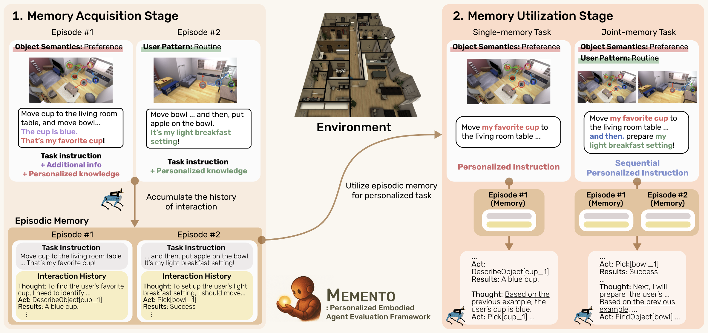

# MEMENTO: Embodied Agents Meet Personalization: Analyzing Memory Utilization for Personalized Assistance



## Abstract

Embodied agents empowered by large language models (LLMs) have shown strong performance in object rearrangement tasks. However, these tasks primarily focus on single-turn interactions with static and simplified instructions, which limits their relevance to real-world personalized assistance. To provide meaningful support, personalized embodied agents must understand personalized knowledge—unique semantics users assign to their environment—and leverage episodic memory to interpret dynamic instructions. Therefore, in this work, we present MEMENTO, a personalized embodied agent evaluation framework designed for comprehensive assessment of memory utilization with personalized knowledge. MEMENTO consists of a two-stage memory evaluation process.  In the *memory acquisition stage*, agents perform tasks with instructions containing personalized knowledge while accumulating the interaction history. Subsequently, the *memory utilization stage* challenges agents to complete the same tasks using modified instructions that require previous interaction history to succeed.  This process enables the evaluation of agents' understanding of personalized knowledge in object rearrangement tasks by focusing on its role in goal interpretation: (1) the ability to identify target objects based on personal meaning (*object semantics*), and (2) the ability to infer object–location configurations from consistent user patterns, such as routines (*user patterns*).
Our evaluation across a range of LLM-powered embodied agents reveals that even frontier models struggle to utilize episodic memory with personalized knowledge, highlighting key limitations and providing insights for developing more personalized embodied agents.

## Installation

### Docker File Build
[Docker file build]

### Datasets
[Dataset Installation via PARTNR repository](https://github.com/facebookresearch/partnr-planner/blob/main/INSTALLATION.md)

## Setup

### Docker Run Command
```bash
docker run -it \ 
  -v /path/to/local/huggingface_cache/:/data/huggingface_cache/ \ # Path to your local model storage
  -v /path/to/local/habitat_data/:/data/ \ # Path to your local Habitat data
  -v /path/to/local/code/:/HabitatLLM/workspace \ # Path to your local workspace
  -e NVIDIA_DRIVER_CAPABILITIES=all \ 
  -u username \ # Your username
  --gpus all \
  --pid=host \
  --name container_name \ # Container name
  image_name/habitat:2.0 \ # Image name
  /bin/bash
```

### Docker Container Internal Structure
```
/HabitatLLM : repository codes
/HabitatLLM/workspace : share volume with local directory
/third_party: habitat, partnr-planner, ...
```

### Commands to Run Inside Container
```bash
$ source activate
$ conda activate habitat
$ ln -s /data /HabitatLLM/data
$ ln -s /HabitatLLM/workspace/HabitatLLM/src /HabitatLLM/src 
$ ln -s /HabitatLLM/workspace/HabitatLLM/scripts /HabitatLLM/scripts
```

Note: HabitatLLM is separately defined in the workspace to facilitate code management through GitHub by establishing symbolic links between local files and volume mounts inside the container.

## Datasets
[Dataset information will be added later]

## Experiments

### Experiments Settings
MEMENTO includes a structured approach to running experiments, as exemplified by stage1:

1. **Experiment Script**: 
   - Path: `./scripts/v1_experiment_stage1.sh`
   - Used to execute the experiment

2. **Data Definition**:
   - Path: `./src/conf/habitat_conf/dataset/v1/v1_stage1.yaml`
   - Defines the dataset configuration for the experiment

3. **LLM Configuration**:
   - Path: `./llm/[desired_model_API].yaml`
   - Defines the model and API key
   - Note: Models like Llama and Qwen are accessed via OpenRouter

4. **Experiment Management**:
   - Path: `./src/conf/v1_experiment/v1_stage1.yaml`
   - Controls overall experiment settings

### Configuration Options
- Set the desired model API in `/llm@evaluation.planner.plan_config.llm` option
- Use `build_memory` to generate memory for the experiments
- Use `save_video` to generate simulation video

### Running an Experiment
To run an experiment, simply execute the appropriate script:

```bash
./scripts/v1_experiment_stage1.sh
```

## License
MEMENTO is MIT licensed. See the [LICENSE](LICENSE) for details.
